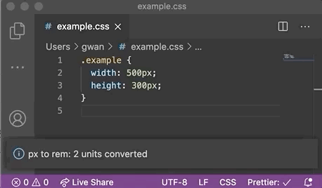
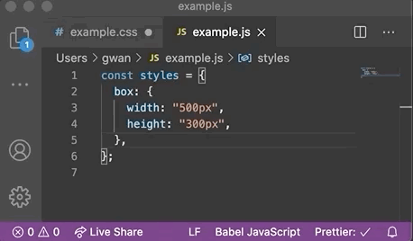

# ⚡️ vscode-convert-px-to-rem

> Published: [VisualStudio Marketplace - Convert px to rem](https://marketplace.visualstudio.com/items?itemName=gwanduke.convert-px-to-rem)

Converts unit "px" to "rem" for the selected area in the document.

## How to use

1. Select an area to convert within code
2. Press <kbd>shift + cmd + p</kbd>
3. Type `> convert px to rem of selections`

### CSS



### JavaScript



## Settings

1. Press <kbd>shift + cmd + p</kbd>
2. Type `> Preferences: Open Settings`
3. And you can use these options.

```jsonc
{
  "convert-px-to-rem.base-px": 16, // set px per 1rem
  "convert-px-to-rem.precision": 4 // floating point precision
}
```

## Todo

- [ ] Shortcut
- [ ] Displaying unit before conversion.

## Extension Settings

- `convert-px-to-rem.basePx`: Specify the default px units used in your project.

## Release Notes
